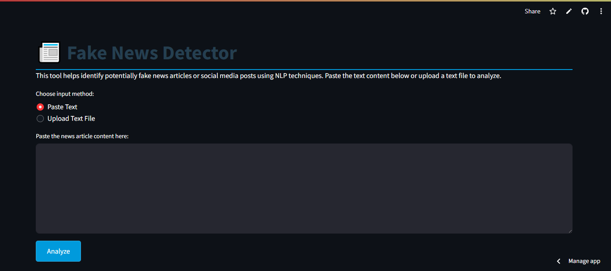

# 🚨 Fake News Detection with Streamlit

This is a Streamlit application that classifies news articles as real or fake using a pre-trained Logistic Regression model with NLP techniques.

## Demo WebApp

This app is deployed on Streamlit Cloud! Check out the live demo:

[](https://fakenewsdetectionwithapp-dp7ezcuehf3yfxhkluhrxw.streamlit.app/)

## Features
- Real-time fake news detection
- Text preprocessing (cleaning, lemmatization, stopword removal)
- Confidence score visualization
- Supports both text input and file upload

## Screenshots

**Main Interface**  



## Requirements
- Python 3.10+
- pandas
- scikit-learn
- streamlit
- nltk

## Installation & Usage

## 1. Clone the repository:
```
$ git clone https://github.com/yourusername/fake-news-detection.git
cd fake-news-detection
```


## 2. Create and activate virtual environment:
```
$ python -m venv venv
$ source venv/bin/activate  # Linux/Mac
$ venv\Scripts\activate    # Windows
```
## 3. Install dependencies:
```
$ pip install -r requirements.txt
```
## 4. Download NLTK data:
```
$ python -c "import nltk; nltk.download('punkt'); nltk.download('stopwords'); nltk.download('wordnet')"
```
## 5. Run the app:

```
$ streamlit run app.py
```
## Model Details
* Algorithm: Logistic Regression

* Accuracy: ~98% on test data

* Features: TF-IDF with n-grams

* Dataset: Combined ISOT and LIAR datasets

## Live Demo
Experience the app live:

https://fakenewsdetectionwithapp-dp7ezcuehf3yfxhkluhrxw.streamlit.app/

## Acknowledgements
* NLTK for text processing

* Scikit-learn for machine learning

* Streamlit for the awesome UI framework

## Contact
For questions or contributions, please contact:
rajesherode2004@gmail.com